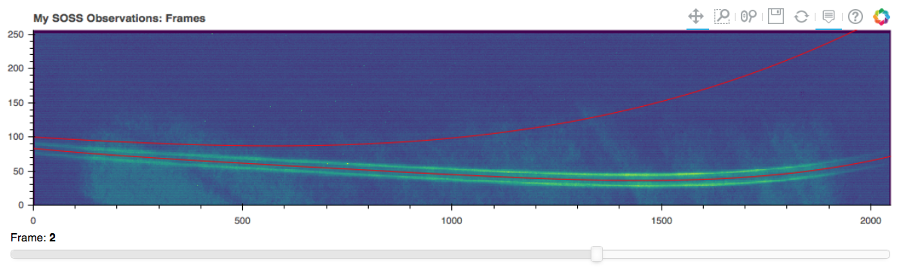

===========
specialsoss
===========

.. image:: https://img.shields.io/pypi/v/specialsoss.svg
        :target: https://pypi.python.org/pypi/specialsoss

.. image:: https://img.shields.io/travis/hover2pi/specialsoss.svg
        :target: https://travis-ci.org/hover2pi/specialsoss

.. image:: https://readthedocs.org/projects/specialsoss/badge/?version=latest
        :target: https://specialsoss.readthedocs.io/en/latest/?badge=latest
        :alt: Documentation Status

.. image:: https://img.shields.io/coveralls/github/hover2pi/specialsoss.svg
        :target: https://coveralls.io/github/hover2pi/specialsoss

.. image:: https://pyup.io/repos/github/hover2pi/specialsoss/shield.svg
     :target: https://pyup.io/repos/github/hover2pi/specialsoss/
     :alt: Updates

SPECtral Image AnaLysis for SOSS
~~~~~~~~~~~~~~~~~~~~~~~~~~~~~~~~

Authors: Joe Filippazzo

This pure Python 3.6+ package performs optimal spectral extraction routines
for the Single Object Slitless Spectroscopy (SOSS) mode of the
Near-Infrared Imager and Slitless Spectrograph (NIRISS) instrument
onboard the James Webb Space Telescope (JWST).

Additional resources:

- `Full documentation <https://specialsoss.readthedocs.io/en/latest/>`_
- `Jupyter notebook <https://github.com/spacetelescope/specialsoss/blob/master/notebooks/specialsoss_demo.ipynb>`_
- `Build history <https://travis-ci.org/hover2pi/specialsoss>`_

Extracting Spectra from SOSS Observations
-----------------------------------------

The headers in JWST data products provide almost all the information
needed to perform the spectral extraction, making the path to your data
the only required input. To load your SOSS exposure, simply do

.. code:: python

   # Imports
   import numpy as np
   from specialsoss import SossExposure
   from pkg_resources import resource_filename

   # Load the exposure
   file = resource_filename('specialsoss', 'files/SUBSTRIP256_CLEAR_uncal.fits')
   obs = SossExposure(file)

Now we can scroll through the ingested data by plotting the frames.

.. code:: python

   obs.plot_frames()

To run a spectral extraction routine, use the `extract` method with
the name of the routine you would like to use. In this example, we'll
use the vanilla column sum extraction.

.. code:: python

   obs.extract('sum', 'uncal')

Finally, we can see the extracted time-series spectra and the monochromatic lightcurves with:

.. code:: python

   obs.plot_results()
